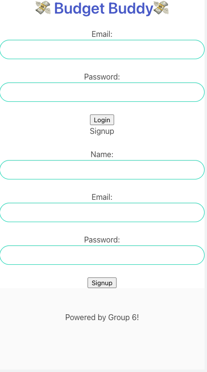
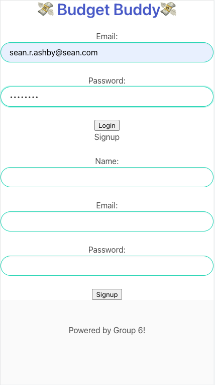
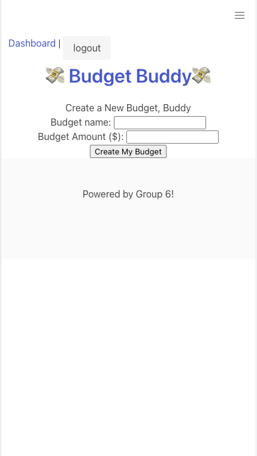
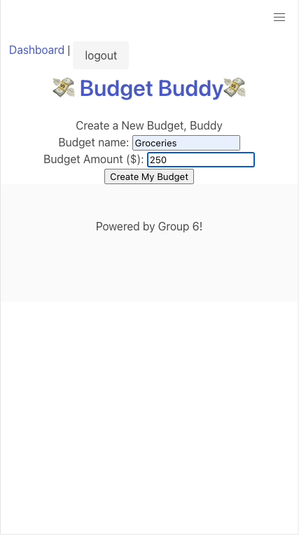

# Budget Buddy 
An MVP project for creating and tracking a budget to keep you on track with life and meet your personal finance goals. 

# Technology Used 
Budget Buddy uses a combination of javascript, handlebars, MySQL2, Node, Heroku, Express.js, Bulma, and sequelize. 

# Screenshots 

